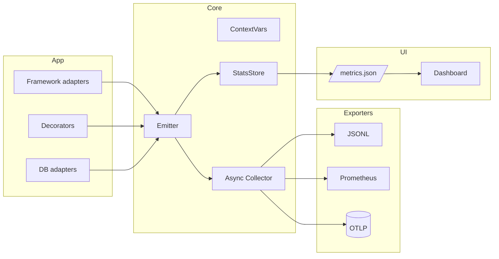

# Architecture

```mermaid
flowchart LR
  subgraph App
    FW[Framework adapters]
    DEC[Decorators]
    DBI[DB adapters]
  end
  subgraph Core
    CTX[ContextVars]
    EMT[Emitter]
    Q[Async Collector]
    ST[StatsStore]
  end
  subgraph Exporters
    JSONL[JSONL]
    PROM[Prometheus]
    OTLP[(OTLP)]
  end
  subgraph UI
    API[/metrics.json/]
    HTML[Dashboard]
  end
  FW --> EMT
  DEC --> EMT
  DBI --> EMT
  EMT --> ST
  EMT --> Q
  Q --> JSONL
  Q --> PROM
  Q --> OTLP
  ST --> API --> HTML
```
