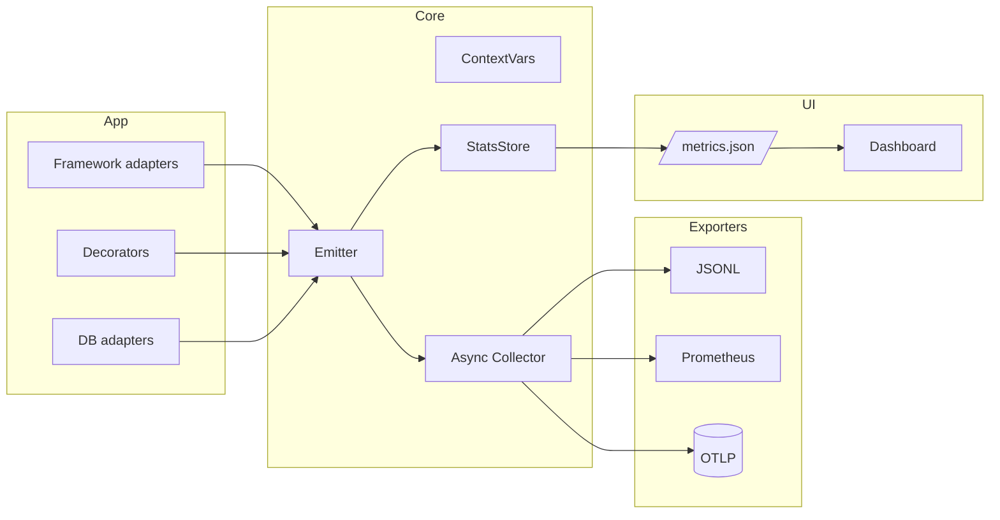
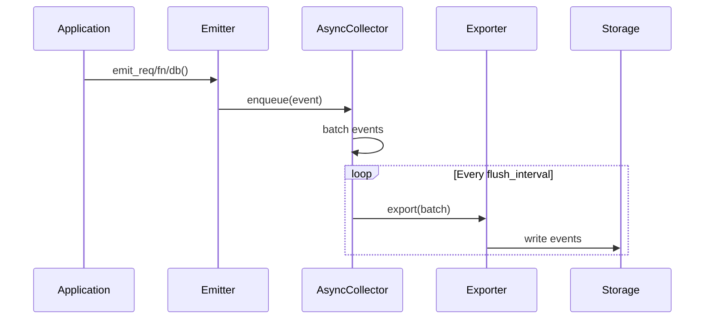

# Architecture

Spyglass is built with a modular, non-blocking architecture designed for high performance and minimal overhead.

## System Overview



## Core Components

### AsyncCollector
The heart of Spyglass's non-blocking architecture.

**Responsibilities:**
- Asynchronous event collection and batching
- Backpressure handling with configurable queue sizes
- Efficient batch processing and export
- Memory management and garbage collection

**Key Features:**
- **Queue Management**: Configurable bounded queues with drop-oldest policy
- **Batch Processing**: Configurable batch sizes for optimal throughput
- **Flush Scheduling**: Configurable flush intervals for latency vs. throughput trade-offs
- **Backpressure Handling**: Automatic event dropping under load

**Configuration:**
```python
collector = AsyncCollector(
    exporter,
    queue_size=2048,        # Maximum events in memory
    batch_max=128,          # Maximum events per batch
    flush_interval=0.1,     # Flush interval in seconds
    drop_oldest=True        # Drop events under backpressure
)
```

### Emitter
High-performance event creation and emission.

**Responsibilities:**
- Event creation with minimal allocations
- Runtime context integration
- Event type specialization (REQ, FN, DB)
- Performance optimization for hot paths

**Performance Characteristics:**
- **Event Creation**: ≤15µs per event
- **Memory Overhead**: ~100 bytes per event
- **Allocation Efficiency**: Minimal object creation
- **Hot Path Optimization**: Inline critical operations

**Event Types:**
```python
# Request events
emitter.emit_req("/api/users", 200, dur_ns=15000000)

# Function events
emitter.emit_fn("expensive_calculation", dur_ns=5000000, error=False)

# Database events
emitter.emit_db("SELECT * FROM users", dur_ns=8000000, rows=100)
```

### Runtime Context
Distributed tracing and context management.

**Components:**
- **Context Variables**: Thread-local and async context storage
- **Trace Management**: Unique trace and span ID generation
- **Context Propagation**: Automatic context inheritance
- **Async Support**: Full async/await compatibility

**Usage:**
```python
from spyglass.runtime import use_span, span_id, get_trace_id, get_span_id

# Create distributed trace context
with use_span(trace_id=span_id()):
    current_trace = get_trace_id()

    # Nested spans inherit trace context
    with use_span(span_id=span_id()):
        nested_span = get_span_id()
        # All events inherit the trace context
```

## Framework Integration

### Flask Adapter
Automatic request/response profiling with hooks.

**Integration Points:**
- **before_request**: Start timing and create context
- **after_request**: Record response metrics and timing
- **teardown_request**: Handle exceptions and cleanup

**Features:**
- Automatic route detection
- Configurable sampling rates
- Route exclusion patterns
- Exception tracking
- Bytes in/out monitoring

**Configuration:**
```python
spyglass = SpyglassFlask(
    app,
    collector=collector,
    exclude_routes=["/health", "/metrics"],
    sample=0.1  # 10% sampling
)
```

### SQLAlchemy Instrumentation
Database query profiling and monitoring.

**Integration Points:**
- **Cursor Execution**: Hook before/after query execution
- **Query Analysis**: Parse and categorize SQL queries
- **Performance Metrics**: Track execution time and row counts
- **Security**: Query redaction for sensitive data

**Features:**
- Microsecond precision timing
- Automatic query redaction
- Row count tracking
- Async engine support
- Query pattern analysis

## Data Flow

### Event Lifecycle



### Performance Characteristics

**Event Processing Pipeline:**
1. **Event Creation**: ≤15µs (Emitter)
2. **Queue Enqueue**: ≤1µs (AsyncCollector)
3. **Batch Processing**: ≤5µs per batch
4. **Export**: Varies by exporter (JSONL: ≤100µs per batch)

**Memory Management:**
- **Event Size**: ~100 bytes per event
- **Queue Memory**: queue_size × 100 bytes
- **Batch Memory**: batch_max × 100 bytes
- **Total Overhead**: (queue_size + batch_max) × 100 bytes

## Exporters

### JSONL Exporter
Rotating log files with configurable retention.

**Features:**
- Automatic file rotation by size/time
- Atomic file operations
- Configurable naming patterns
- Compression support

**Configuration:**
```python
exporter = JSONLExporter(
    dir="./logs",
    rotate_bytes=1024*1024,  # 1MB per file
    rotate_secs=3600,        # Hourly rotation
    filename_template="spyglass-{timestamp}.jsonl"
)
```

### Console Exporter
Development-friendly output formatting.

**Features:**
- Pretty-printed output
- Color-coded event types
- Compact mode for production
- Configurable formatting

### Prometheus Exporter (Planned)
Native Prometheus metrics integration.

**Planned Features:**
- HTTP metrics endpoint
- Custom metric definitions
- Grafana dashboard templates
- Alerting rules

## UI Dashboard

### StatsStore
In-memory statistics with rolling windows.

**Features:**
- 15-minute rolling window (configurable)
- Real-time metric calculation
- Error tracking and display
- Performance trend analysis

**Metrics:**
- Request latency percentiles
- Error rates by route
- Throughput statistics
- Database query performance

### Dashboard Components

**Real-time Metrics:**
- Request latency charts
- Error rate monitoring
- Throughput graphs
- Database performance

**Error Tracking:**
- Recent error display
- Exception type analysis
- Route-specific error rates
- Stack trace information

## Performance Optimization

### Memory Management

**Efficient Data Structures:**
- Minimal object allocation
- Reusable event dictionaries
- Efficient string handling
- Optimized serialization

**Garbage Collection:**
- Minimal GC pressure
- Efficient memory reuse
- Predictable memory usage
- Low fragmentation

### Async Processing

**Non-blocking Operations:**
- Async file I/O
- Non-blocking queues
- Efficient batching
- Background processing

**Concurrency Handling:**
- Thread-safe operations
- Async context support
- Efficient locking
- Minimal contention

## Scalability Considerations

### Horizontal Scaling

**Multiple Instances:**
- Stateless collectors
- Shared storage backends
- Load balancing support
- Distributed tracing

**Performance Limits:**
- Single instance: 100K+ events/second
- Memory usage: Linear with queue size
- CPU usage: Minimal overhead
- Network I/O: Exporter dependent

### Vertical Scaling

**Resource Optimization:**
- Queue size tuning
- Batch size optimization
- Flush interval adjustment
- Memory allocation tuning

**Monitoring:**
- Queue depth monitoring
- Memory usage tracking
- Performance metrics
- Health checks

## Security Considerations

### Data Privacy

**Query Redaction:**
- Automatic SQL parameter hiding
- Custom redaction rules
- Sensitive data protection
- Audit trail maintenance

**Access Control:**
- Dashboard authentication
- API endpoint protection
- Role-based access
- Audit logging

### Production Hardening

**Error Handling:**
- Graceful degradation
- Circuit breaker patterns
- Fallback mechanisms
- Health monitoring

**Resource Protection:**
- Memory limits
- CPU throttling
- File descriptor limits
- Network rate limiting

## Monitoring and Observability

### Health Checks

**System Health:**
- Collector status
- Exporter health
- Queue depth monitoring
- Error rate tracking

**Performance Metrics:**
- Event processing rate
- Memory usage
- CPU utilization
- I/O performance

### Alerting

**Threshold Monitoring:**
- Queue depth alerts
- Error rate thresholds
- Performance degradation
- Resource exhaustion

**Integration:**
- Prometheus alerts
- Grafana dashboards
- PagerDuty integration
- Slack notifications

## Future Architecture

### Planned Enhancements

**v0.2.0:**
- Additional database integrations
- Enhanced performance monitoring
- Better error handling

**v0.3.0:**
- ASGI framework support
- WebSocket profiling
- Advanced async features

**v0.4.0:**
- Prometheus integration
- Advanced sampling
- Resilience features

**v1.0.0:**
- Enterprise features
- High availability
- Comprehensive monitoring
